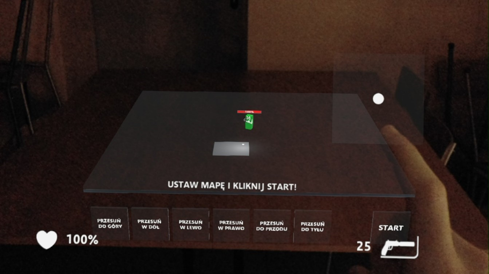
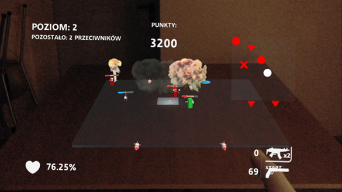
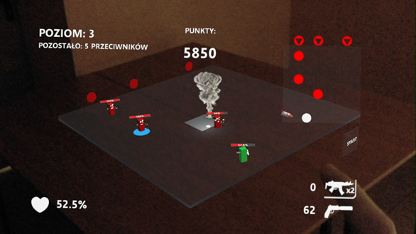
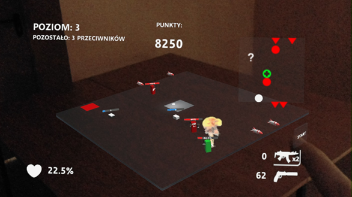
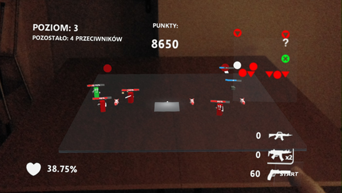
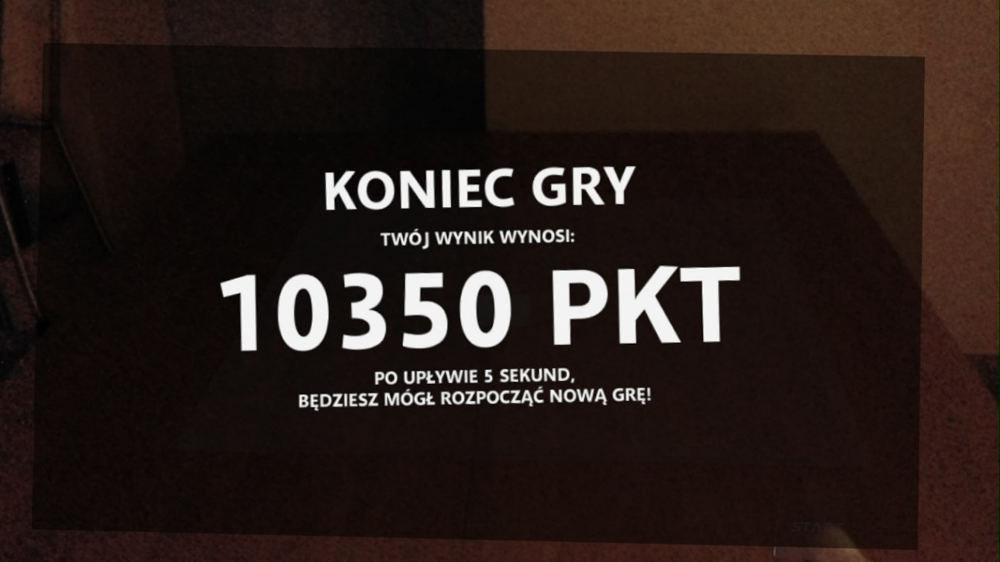

# ar-augmented-reality-game-unity

## Table of contents
* [General info](#general-info)
* [Usage](#usage)
* [Screenshots](#screenshots)

## General info
This project includes an implementation of the [game of life](https://en.wikipedia.org/wiki/Conway%27s_Game_of_Life) on the basis of an event simulation engine.
	
## Usage
If you want to run or modify this game on your HoloLens, you need:
Unity 2017.4.33f1 (64-bit)
Download:  https://download.unity3d.com/download_unity/a8557a619e24/Windows64EditorInstaller/UnitySetup64-2017.4.33f1.exe
Visual Studio 2017 15.9.29
Download:  https://integritypartners.pl/pobierz-microsoft-visual-studio-2017-najnowsza-wersja-jest-juz-dostepna/
HoloToolkit 2017.4.1.0
Download:  https://github.com/Microsoft/MixedRealityToolkit-Unity/releases/tag/2017.4.1.0
After configuring the HoloToolKit and copying the .cs scripts and scene to the Unity project, you should be able to install the game on HMD.

## Screenshots

